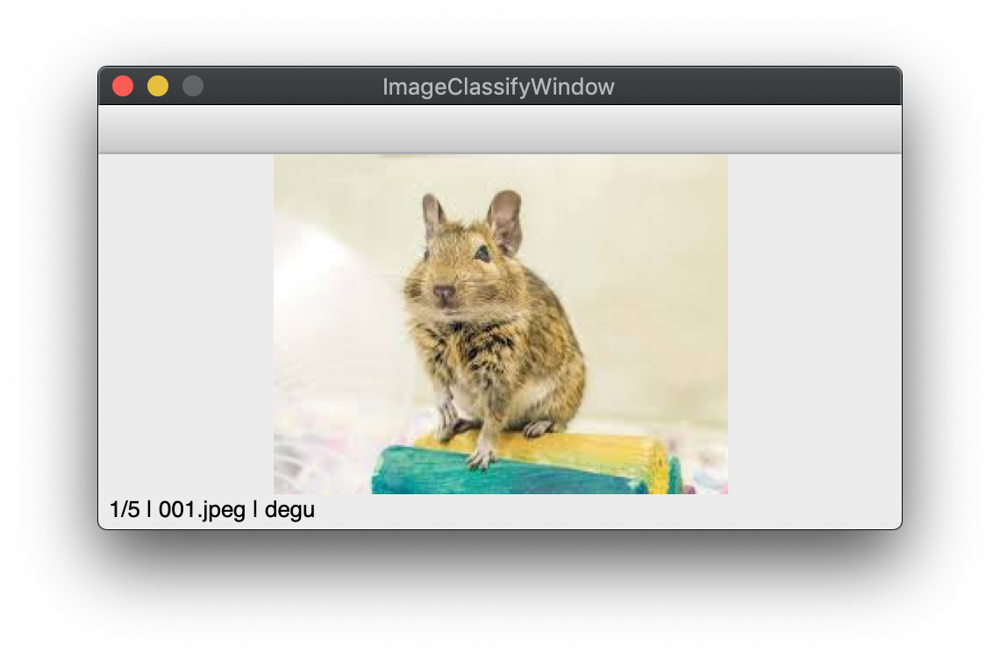

# image_classifier




## Usage
```
python main.py <input dir> \
  -i <image dir> \
  -c <class names csv path> \
  -l <label csv path> \
  -o <output dir>
```  
example:  
```
python main.py sample \
 -i image \
 -c class_names.csv \
 -l label.csv \
 -o result
```
### Keymap
```
  [number key]: classify
  [x]: delete label
  [j]: next image
  [k]: previous image
  [p]: print all labels
  [q]: quit
```
